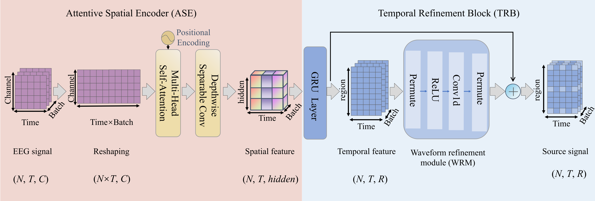

#This is the code repository for the paper "ASTR-Net: Attentive Spatial-Temporal Refinement Network for Personalized EEG Source Imaging".

The repository provides the required network architecture and main function code.

1. To enable personalized training head models, please modify the `--fwd` attribute in `main.py` and select the personalized lead array located in `Personalized Training`.
2. The lead array and simulation data used for model pre-training are based on the dataset provided by DeepSIF. [Please visit](https://github.com/bfinl/DeepSIF) We cite this work in this paper and express our gratitude herein.
3. To implement the two-stage fine-tuning, please adjust the following two parameters in `main.py`: `lr_spatial` and `lr_temporal`. These parameters control the spatial and temporal modules, respectively.
